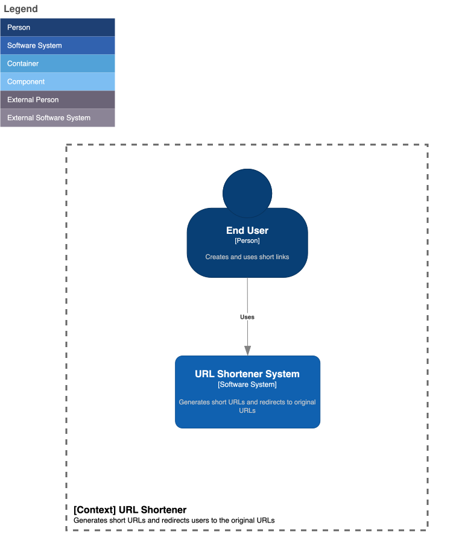
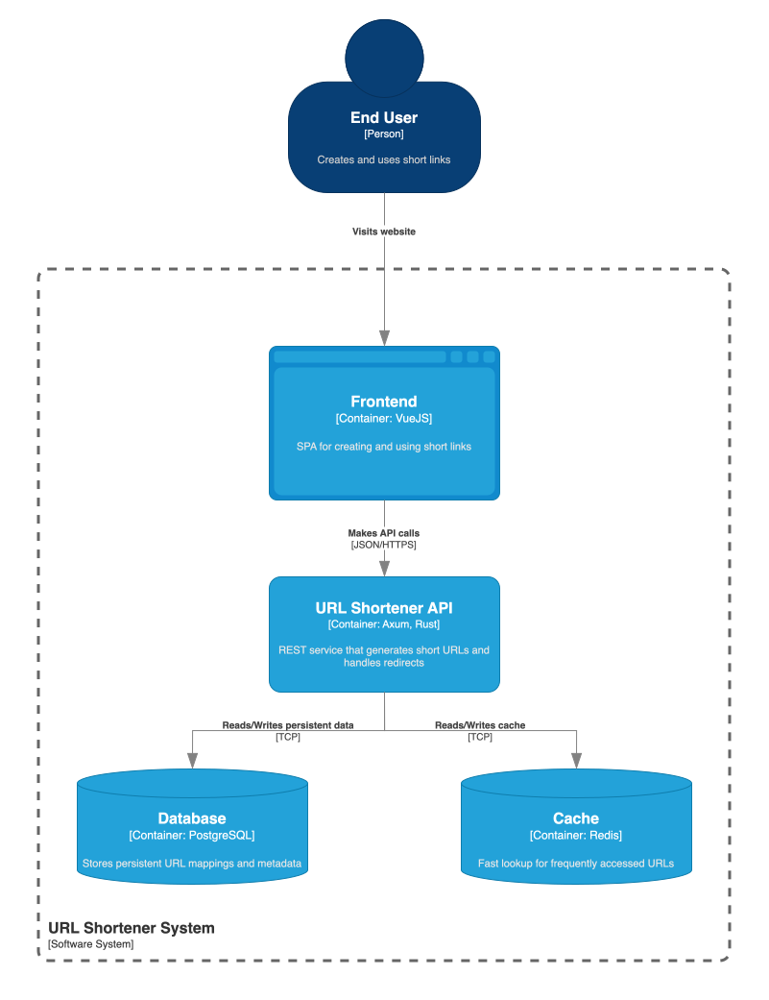
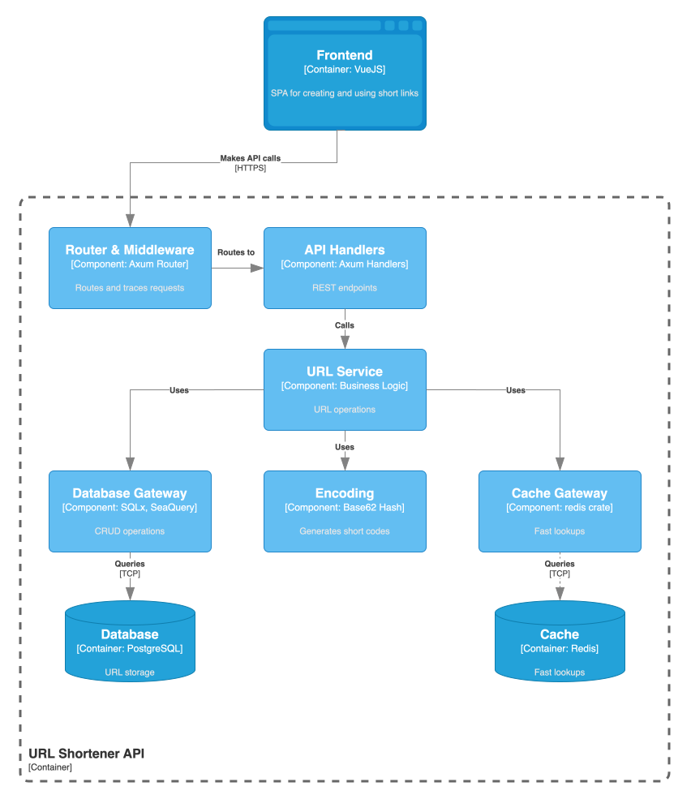
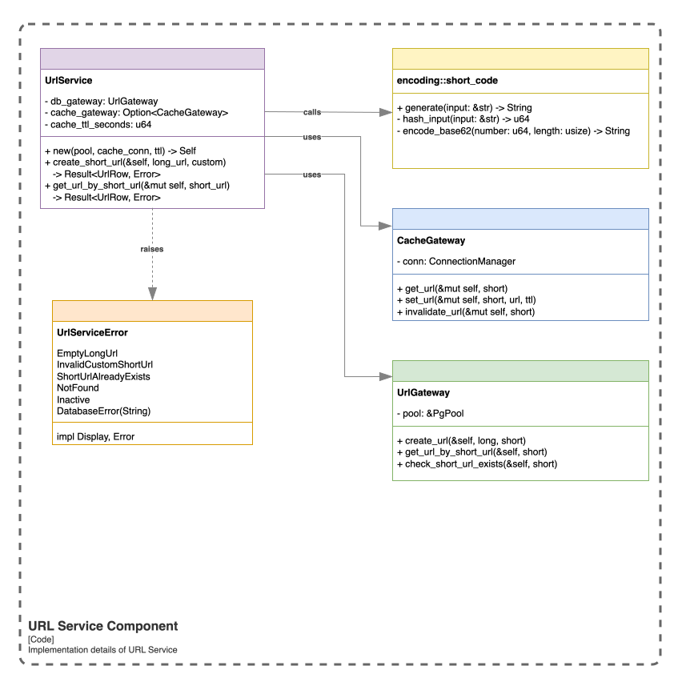

# URL Shortener

A URL shortening service designed as a System Design, Kubernetes and Rust
practice project (for fun).

## Table of contents

- [System design](#system-design)
  - [Requirements](#requirements)
  - [Architecture](#architecture)
  - [Key design decisions](#key-design-decisions)
- [Technical stack](#technical-stack)
- [Performance considerations](#performance-considerations)
- [Future improvements](#future-improvements)
- [Run locally](#run-locally)
- [Contributing](#contributing)

## System design

### Requirements

#### Functional requirements

1. **URL shortening**: Given a long URL, generate a short, unique alias
2. **URL redirection**: Redirect users from short URL to original URL
3. **Custom short URLs**: Support user-defined short URLs (optional)
4. **Expiration**: No expiration by default

#### Non-functional requirements

1. **High availability**: System should remain operational
2. **Low latency**: Fast redirection response times
3. **Scalability**: Support high read throughput
4. **Durability**: URLs must not be lost once created

#### Traffic estimates

- **Write-to-read ratio**: 1:100 (reads heavily dominate)
- **Expected QPS**:
  - Writes: ~100 req/s
  - Reads: ~10,000 req/s
- **Storage**: ~10M URLs per year × 500 bytes ≈ 5GB/year

### Architecture

The architecture is documented using the **C4 model** 
(Context, Container, Component, Code), providing multiple levels of abstraction:

#### C1: System context



#### C2: Container architecture



- **API container**: REST-ful API built with Axum web framework
- **Database**: PostgreSQL for durable URL storage
- **Cache**: Redis for high-performance lookups

#### C3: Component architecture



- **API handlers**: Thin HTTP request/response handlers
- **URL service**: Business logic for URL operations
- **Database gateway**: Data access layer for PostgreSQL
- **Cache gateway**: Caching layer for Redis
- **Encoding module**: Base62 hash-based short code generation

#### C4: Code-level design



For a combined view of all layers see [`.assets/c4_model.svg`](.assets/c4_model.svg)
or [editable source](.assets/c4_model.drawio).

### Key design decisions

#### 1. Redirect type: temporary vs permanent (302/307 vs 301)

**Decision**: Use **307 (temporary redirect)**

**Rationale**:

- **Analytics & metrics**: Each request hits our server, enabling accurate click tracking
- **Cache control**: Browsers don't permanently cache 307 redirects, allowing:
  - URL destination updates
  - A/B testing capabilities
  - Revocation of malicious URLs
- **Method preservation**: Unlike 302, 307 guarantees the HTTP method is preserved on redirect
- **Flexibility**: Can change destination URL or implement rate limiting

**Trade-off**: Slightly higher server load compared to 301.

#### 2. Short URL generation: hash-based approach

**Algorithm**: Base62 encoding of hash (0-9, a-z, A-Z)

```
hash(long_url) => encode_base62() => 7-character URL
```

**Properties**:

- **Length**: 7 characters
- **Collision space**: 62^7 or ~3.5 trillion combinations

**Benefits**:

- Predictable, uniform distribution
- URL-safe characters only

**Collision handling**: Database unique constraint + retry with modified input

#### 3. Caching strategy: cache-aside pattern

**Implementation**:

1. Check cache (Redis) for short URL
2. If **cache hit**: Return cached long URL
3. If **cache miss**:
   - Query database
   - Populate cache with TTL (1 hour default)
   - Return result

**Benefits**:

- Reduces database load for frequently accessed URLs
- Fast response times for cached URLs
- Cache failures don't break the system (graceful degradation)

#### 4. Database schema

**Simple, normalized schema**:

```sql
CREATE TABLE urls (
    id BIGSERIAL PRIMARY KEY,
    long_url VARCHAR(2048) NOT NULL,
    short_url VARCHAR(50) NOT NULL UNIQUE,
    status VARCHAR(20) NOT NULL DEFAULT 'active',
    created_at TIMESTAMP NOT NULL DEFAULT NOW(),
    updated_at TIMESTAMP NOT NULL DEFAULT NOW()
);

CREATE INDEX idx_short_url ON urls(short_url);
CREATE INDEX idx_created_at ON urls(created_at DESC);
```

## Technical stack

### Core technologies

| Component         | Technology |
|-------------------|------------|
| **Language**      | Rust       |
| **Web Framework** | Axum       |
| **Database**      | PostgreSQL |
| **Cache**         | Redis      |
| **Frontend**      | Vue        |
| **Orchestration** | Kubernetes |

## Performance considerations

### Caching

- **TTL**: 1 hour (configurable via `config`)
- **Graceful degradation**: Cache failures don't break redirection

### Database optimization

1. **Indexes**:
   - `short_url` (unique) for fast lookups
   - `created_at` for time-range queries

2. **Connection pooling**:
   - Configured pool size prevents connection exhaustion

### Scalability

**Horizontal scaling**:

- Stateless API layer (scales behind load balancer)
- Read replicas for PostgreSQL (if needed)
- Redis cluster for cache distribution

**Current bottleneck**: Single PostgreSQL instance (write operations)

**Solution path**:

- Database sharding (partition by short URL range)
- Write-through cache for hot URLs
- CDN for geographic distribution

## Future improvements

### Short-term

- [ ] User accounts and ownership of URLs
- [ ] Per-IP/user rate limiting
- [ ] Check for malicious URLs
- [ ] Time-based URL expiration

### Long-term

- [ ] OpenTelemetry integration for observability
- [ ] QR code generation for sharing URLs

## Run locally

**Prerequisites:** Docker, [minikube](https://minikube.sigs.k8s.io/docs/start/), 
kubectl, [just](https://github.com/casey/just)

```bash
minikube start
just deploy
kubectl port-forward svc/url-shortener-frontend 8080:80
```

Open [http://localhost:8080](http://localhost:8080).

## Contributing

Please don't =)
